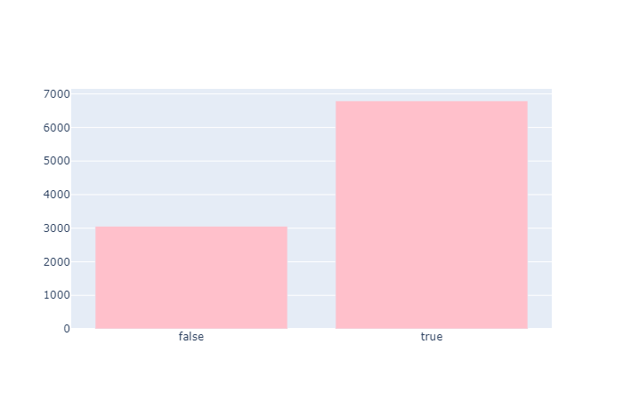

# Corona19-Data-Visualization
Corona19 Data Visualization Examples from [코로나 데이터 시각화 AI 경진대회] with plotly

# Graphs
## Ratio of elderly population distribution by region

## Group infection rate

## The main route of infection rate

## Search Trend

## The average number of days treatment for each age groups

# Reference
https://dacon.io/competitions/official/235590/overview/

https://github.com/chan157/DACON_COVID/tree/c30f35267f304862ad6415335b094d4cabce0d3b
